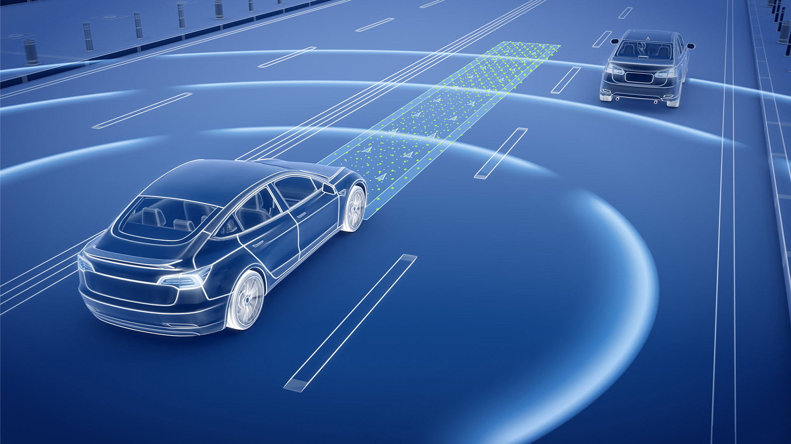
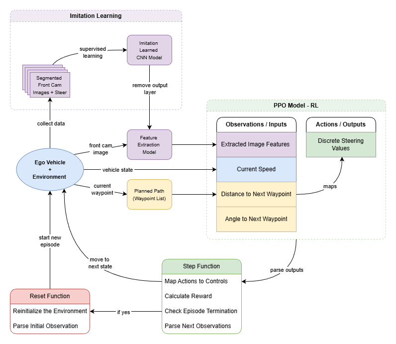

# Imitation-Initialized-PPO



- Lane-Keeping with Hybrid Imitation and Reinforcement Learning (PPO)
- CNN for feature extraction via imitation learning and PPO for reinforcement learning.

## High-level Diagram



## How to Set Up

### Pre-requisites
- GPU relevant to RTX 3070 or better
- CARLA 0.9.15 [Download for Windows](https://tiny.carla.org/carla-0-9-15-windows) 
- Anaconda Distribution (conda 24.9.2 or later)

### Steps
1. Clone the repository:
    ```bash
    git clone https://github.com/daveshenal/Imitation-Initialized-PPO.git
    ```
2. Navigate to the project directory:
    ```bash
    cd Imitation-Initialized-PPO
    ```
3. Create PyTorch GPU Environment:
    ```bash
    cd environments\pt_py38
    ```
    ```bash
    conda create --name pt_py38 python=3.8 --file conda-requirements.txt
    ```
    ```bash
    conda activate pt_py38
    ```
    ```bash
    pip install --no-deps -r pip-requirements.txt
    ```
4. Create TensorFlow GPU Environment:
    ```bash
    cd ..\tf_py310
    ```
    ```bash
    conda create --name tf_py310 python=3.8 --file conda-requirements.txt
    ```
    ```bash
    conda activate tf_py310
    ```
    ```bash
    pip install --no-deps -r pip-requirements.txt
    ```
    
4. Activate the Environments:
    ```bash
    conda activate <env_name>
    ```

## Contact
- Author: Dave Perera
- Email: daveshenal281@gmail.com 
---

